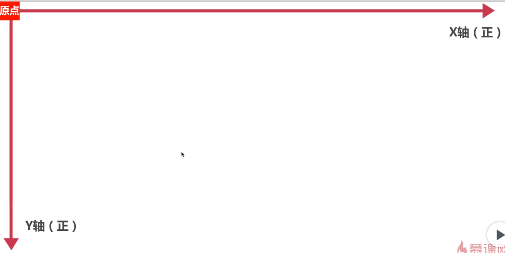
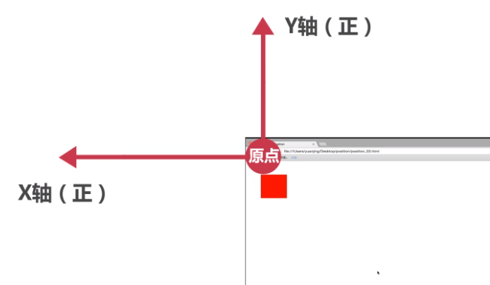

# CSS position属性
### 块级元素
* 总是在新行上开始
* 高度、行高以及外边距和内边距都可控制
* 宽度缺省是它的容器的100%，除非设定一个宽度
* 可以容纳内联元素和其他块元素

### 内联元素
* 和其他元素都在一行上
* 高、行高及外边距和内边距不可改变
* 宽度就是它的文字和图片的宽度，不可改变
* 内联元素只能容纳文本或者其他内联元素

### 文档流
将窗体自上而下分为一行行，并在每行中按从左至右的顺序排放元素，即为文档流。

有三种情况使得元素脱离文档流而存在，分别是浮动、绝对定位、固定定位。
当一个元素从正常文档流中抽出后，仍然在文档流中的其他元素将忽略该元素并填补他原先的空间。


### 布局方式
#### 标准流
```html
<!DOCTYPE html>
<html lang="en">
<head>
    <meta charset="UTF-8">
    <title>标准文档流</title>
    <style>
        .test{
            width: 100px;
            height: 100px;
            background: red;
            border: 1px solid #FFF
        }
    </style>
</head>
<body>
    <div class="test"></div>
    <div class="test"></div>
    <div class="test"></div>
    <span>文字1</span>
    <span>文字2</span>
    <span>文字3</span>
</body>
</html>
```
#### 浮动
这里暂不表，如下，把图像向右浮动
```CSS
img {
  float:right;
}
```
#### 定位
当元素不指定position属性时，默认为static。表示元素出现在正常的流中（忽略 top, bottom, left, right 或者 z-index 声明）。

1.相对定位：相对于元素在文档流中位置进行偏移，但保留原占位。

```html
<!DOCTYPE html>
<html lang="en">
<head>
    <meta charset="UTF-8">
    <title>Position-Relative</title>
    <style>
        .test{
            width: 100px;
            height: 100px;
            background: red;
            position: relative;
            right: 100px;
            top: 50px;
        }
    </style>
</head>
<body>
<div class="test"></div>
</body>
</html>
```
改变 left、top、right、bottom值，我们可以得到以下的规律

top left：


right bottom：


2.绝对定位：完全脱离文档流，相对于position属性非static值的最近父级元素进行偏移。

绝对定位元素与同级元素之间的位置关系
```html
<!DOCTYPE html>
<html lang="en">
<head>
    <meta charset="UTF-8">
    <title>Position-absolute-bro</title>
    <style>
        *{
            margin: 0;
            padding: 0;
        }
        .test{
            width: 100px;
            height: 100px;
            background: red;
            position: absolute;
            right: 100px;
            bottom: 150px;
        }
        .bro{
            width: 100px;
            height: 100px;
            background: blue;
        }
        body{
            height: 3000px;
        }
    </style>
</head>
<body>
<div class="bro"></div>
<div class="test"></div>
</body>
</html>
```
绝对定位的元素与父亲元素的位置关系
```html
<!DOCTYPE html>
<html lang="en">
<head>
    <meta charset="UTF-8">
    <title>Position-absolute-parent</title>
    <style>
        *{
            margin: 0;
            padding: 0;
        }
        .test{
            width: 100px;
            height: 100px;
            background: red;
            position: absolute;
            left: 0px;
            top: 0px;
        }
        .parent{
            width: 300px;
            height: 300px;
            background: blue;
            margin-left: 200px;
            margin-top: 200px;
        }
        body{
            height: 3000px;
        }
    </style>
</head>
<body>
<div class="parent">
    <!-- parent不具备定位属性，将窗体的四个角左右坐标-->
    <!--parent 具备定位属性呢？-->
<div class="test"></div>
</div>
</body>
</html>
```
3.固定定位：完全脱离文档流，相对于视区进行偏移

```html
<!DOCTYPE html>
<html lang="en">
<head>
    <meta charset="UTF-8">
    <title>Position-Fixed</title>
    <style>
        .test{
            width: 100px;
            height: 100px;
            background: red;
            position: fixed;
            left: 0px;
            top: 0px;
        }
        .parent{
            width: 300px;
            height: 300px;
            background: blue;
            position: absolute;
            margin-left: 200px;
            margin-top: 200px;
        }
        body{
            height: 3000px;
        }
    </style>
</head>
<body>
<div class="parent">
    <!-- parent具备定位属性，也不会影响子元素的定位-->
    <div class="test"></div>
</div>
</body>
</html>
```
4.定位属性的继承

```html
<!DOCTYPE html>
<html lang="en">
<head>
    <meta charset="UTF-8">
    <title>position-inherit</title>
    <style>
        *{
            margin: 0px;
            padding: 0;
        }
        /*改变parent的position属性会怎么样？*/
        .parent{
            width: 300px;
            height: 300px;
            background: blue;
        }
        .child{
            width: 100px;
            height: 100px;
            background: red;
            left: 100px;
            top: 100px;
            position: inherit;
        }

    </style>
</head>
<body>
    <div class="parent">
        <div class="child"></div>
    </div>
</body>
</html>
```
### 元素的层级
```CSS
z-index:0
```

```html
<!DOCTYPE html>
<html lang="en">
<head>
    <meta charset="UTF-8">
    <title>z-index</title>
    <style>
        .div1{
            height: 100px;
            width: 100px;
            background: blue;
            position: relative;
            /*z-index: 1;*/
            left: 0;
            top: 0;
        }
        .div2 {
            height: 100px;
            width: 100px;
            position: relative;
            background: red;
            left: 0px;
            top: -100px;
        }
    </style>
</head>
<body>
    <div class="div1"></div>
    <div class="div2"></div>
    <!--加个parent，parent的z-index 大于 div2，里面有的child ，然后child的z-index小于div2？-->
</body>
</html>
```

> 若父元素的层级大于相邻元素的层级，那么无论子元素的层级是否小于父元素相邻元素的层级，该子元素层级都将大于父元素的相邻元素的层级。
